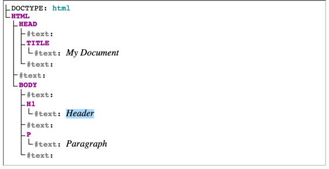

# DOM
## Document Object Modal

### What is dom? 

The Document Object Model (DOM) is a programming API for HTML and XML documents. It defines the logical structure of documents and the way a document is accessed and manipulated.

Document is present in window object 

- document object modal
- overview 
- how to use 
- deep study 

note: The document object is the root node of the HTML document. The document object is a property of the window object.

Window object − Top of the hierarchy. It is the outmost element of the object hierarchy. Document object − Each HTML document that gets loaded into a window becomes a document object. The document contains the contents of the page.

## Understanding the DOM Tree and Nodes

The DOM is often referred to as the DOM tree, and consists of a tree of objects called nodes. In the Introduction to the DOM, we went over what the Document Object Model (DOM) is, how to access the document object and modify its properties with the console, and the difference between HTML source code and the DOM.

# The DOM Tree and Nodes

All items in the DOM are defined as nodes. There are many types of nodes, but there are three main ones that we work with most often:

1. Element nodes
1. Text nodes
1. Comment nodes

When an HTML element is an item in the DOM, it is referred to as an element node. Any lone text outside of an element is a text node, and an HTML comment is a comment node. In addition to these three node types, the document itself is a document node, which is the root of all other nodes.

The DOM consists of a tree structure of nested nodes, which is often referred to as the DOM tree. You may be familiar with an ancestral family tree, which consists of parents, children, and siblings. The nodes in the DOM are also referred to as parents, children, and siblings, depending on their relation to other nodes.

The html element node is the parent node. head and body are siblings, children of html. body contains three child nodes, which are all siblings — the type of node does not change the level at which it is nested.

    <html lang="en">
    <head>
        <title>Dom Traversing</title>
        
    </head>
    <body>
        

            <h1> Header </h1>
            
 Paragraph 

        

    </body>
    </html>

let's analyze the above code 
DoM Tree

In this code
 
                      Document 
                        ||
            =========  HTML ===============   
            ||          ||                ||
           Head         /n           =====body====
            ||                        ||    ||    ||
            ||                        /n    dIV   /n
            ||                               ||
    /n    title  /n  script  /n              ||
            ||                               ||
        Dom Traversing                       ||
                                    /n   h1     /n    p
                                         ||          ||
                                      Header       Paragraph

In the above example :

Document - Root Node 
  - Document is js object 

HTML - Root Element  
 - child node of document and parent of head , /n , body  

HEAD
- child node of HTML  

/n  = It represents white spaces - html dom also consists white spaces)
- child node of html 

BODY
- child node of HTML  

Head has 5 childs /n , title, /n , script , /n 

title has a text node => dom traversing 

Body has 3 childs /n , div, /n 

div has 4 childs /n , h1, /n , p

h1 has a text node => Header

p has a text node => Paragraph  

body and head are siblings 

### DOM Representation

We have 

Element Node 

Text Node 

We have
Child 
Parents Relationship

Note : DOM white spaces bhi dom tree m store krta hai but by default hmare html page m styling m white-space property normal hoti hai islia webpage p wo spaces show nhi hote 
Hum white space property pre krke white spaces check krskte hai by default normal hoti h islia hume change krne ki need nhi hoti

    

